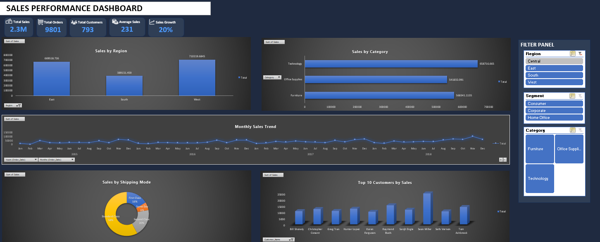

# Excel Sales Performance Dashboard

This project presents an interactive Sales Performance Dashboard built using Microsoft Excel.

The goal of this dashboard is to analyze sales performance across regions, product categories, customers, and time to generate meaningful business insights.

---

## Project Overview

The dashboard transforms raw sales data into a visual and interactive analytics tool that helps identify trends, top customers, and revenue drivers.

---

## Dashboard Features

• KPI tracking (Total Sales, Total Orders, Total Customers, Average Sales, Sales Growth)

• Sales performance by Region

• Category-wise revenue analysis

• Monthly sales trend visualization

• Top 10 customers by sales

• Shipping mode distribution

• Interactive filtering using slicers

---

## Tools & Techniques Used

• Microsoft Excel  
• Pivot Tables  
• Pivot Charts  
• Slicers for interactive filtering  
• Dashboard design and data visualization

---

## Key Insights

• The West region generates the highest revenue.

• Technology is the top-performing category.

• Sales show consistent growth across years.

• A small group of customers contributes significantly to overall revenue.

---

## Dashboard Preview

---

## Skills Demonstrated

• Data Analysis  
• Data Visualization  
• Business Intelligence  
• Excel Dashboard Development
